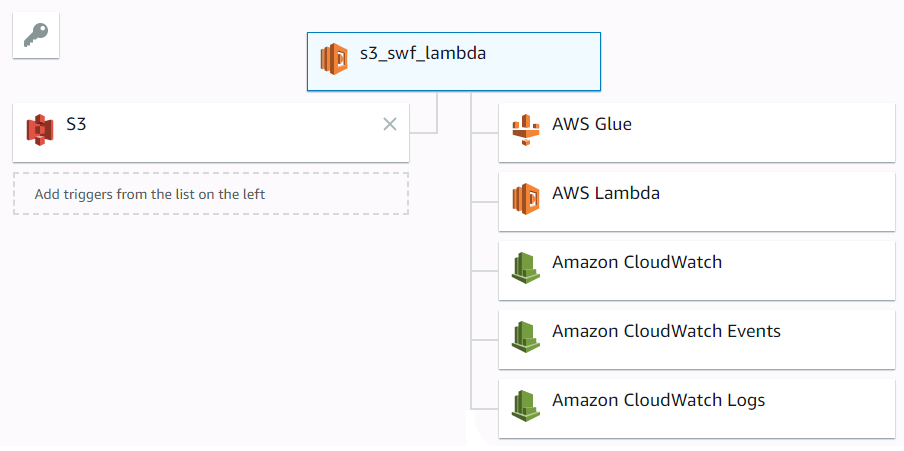
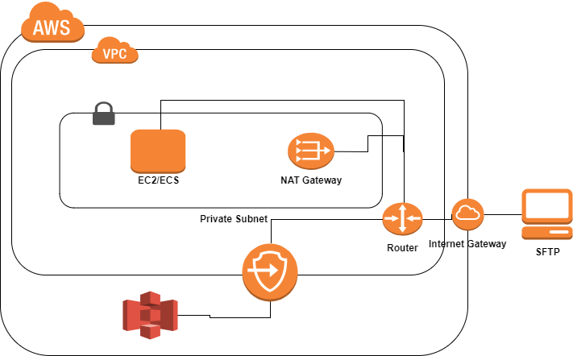

# EDP-INFRA

This repo contains all the required modules to create edp infrastucture.It basically contains configurations as tfvars files for every environment and remote state configuration. Remote state is maintained in S3 and creation of DynamoDB lock table and S3 bucket for state is created only once.

NOTE:
Terraform is used to launch the aws services. Jenkins is required to integrate with Terraform so that terraform is available in the node.

Other Repo has maintains Jenkinsfile. As part of this Jenkins file, repo should specify what aws services it has to deploy.Jenkinsfile maintains configuration that is the sequence in which this service needs to be deployed.

Environment specific configuration: Running Mode is passed through environment variable. Use the corresponding tfvars file for given environment used inside each script folder in edp_infra repo. 

There are two differnt scripts folders:

```
Lambda
SFTP
```

These folder contains modules which extend the terraform modules defined in Commerical cloud.


### LAMBDA

It contains example folder which as of now extends locally stored terraform module. 



In this case we have a s3 trigger which starts the execution of lambda function upon dropping a file in the s3 bucket which have added as trigger. We can define on what actions and on what files lambda should be triggered.

### SFTP

It contains three different modules which extends terraform module from commerical cloud modules. 
	* [VPC]() 
	* [ECS]()
	* [S3]()
	


The infra structure for FTP must be inside our VPC. This VPC has an endpoint to s3.
* VPC uses Security Group certain default rules to secure the private & public Subnets. We have added few inbound rule like SSH, ALL TCP etc.
* Once vpc infra is up, run a script which update the tfvars file as few variables used in ecs have dependency over them (viz. private subnet and vpc id and security group) 

An ECS is running in this vpc which runs docker image in the container. These image contains our spring boot application and required ppk files. 
* IAM role for task execution has all the required policy.

A S3 Bucket is required to place the incoming files from clients.  

``` 
* The sequence of modules which will be deployed as part of this infra : [vpc, ecs, s3]. This sequence will be provided by the jenkinsfile by the repo which wants to create this infrastructure. 
* tfvars file is selected based on the Running Mode passed as environment variable.
```
